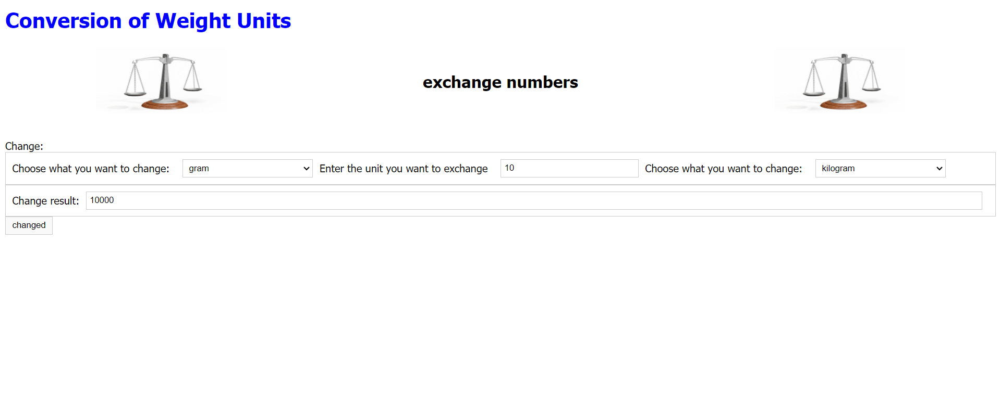

# Weight Conversion Website with JavaSCript

<a href="Images/HomePage.png">
    
</a>

This is a simple web application built using basic JavaScript for converting mass units.

## Technologies Used

- HTML
- CSS
- JavaScript

## Preview

You can see a live preview of the website [here](https://got17.github.io/Weight-Conversion-Web/).

## Getting Started

To get a local copy up and running follow these simple steps.

### Installation

1. Clone the repo
   ```sh
   git clone https://github.com/Got17/Weight-Conversion-Web.git
   ```
2. Navigate to the project directory
   ```sh
   cd Weight-Conversion-Web
   ```
### Usage

1. Open the project in your favorite code editor.
2. Build the project using the following command:
   ```sh
   dotnet build
   ```
3. Run the project:
   ```sh
   dotnet run
   ```
4. Open your web browser and navigate to [http://localhost:5000](http://localhost:5000) to view the application.

## Contributing

Contributions are what make the open-source community such an amazing place to learn, inspire, and create. Any contributions you make are **greatly appreciated**.

1. Fork the Project
2. Create your Feature Branch (`git checkout -b feature/AmazingFeature`)
3. Commit your Changes (`git commit -m 'Add some AmazingFeature`)
4. Push to the Branch (`git push origin feature/AmazingFeature`)
5. Open a Pull Request
